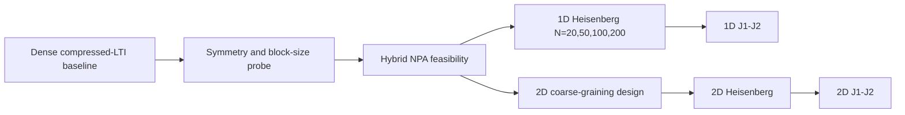

# Research plan — coarse-grained NPA certification

Updated 2026-07-28. This is the working execution plan for challenge [QuantumBFS/quantum.harness#49](https://github.com/QuantumBFS/quantum.harness/issues/49). The shorter [PLAN.md](PLAN.md) remains the ratified statement of scope, target sizes, success criteria, and kill criteria.

## Research question

Can certificate-preserving RG coarse-graining be combined with structured NPA constraints so that certified lower bounds for spin-1/2 Heisenberg systems become both tighter and cheaper than either compressed-LTI or structured NPA alone?

## Intended contribution

The project is not an effective-Hamiltonian truncation. Coarse-graining acts on the relaxation constraints through compatible maps, so every accepted SDP optimum remains a lower bound on the original Hamiltonian. The intended new contribution is a hybrid relaxation that retains this guarantee while adding selected moment, state-optimality, and symmetry constraints from structured NPA.

The primary deliverable is the challenge result. A publishable method result would require demonstrating a reproducible accuracy-per-cost improvement from the hybrid constraints, not merely reproducing the two parent methods independently.

## Working organization

Research code is organized as a vertical slice per physical model. Shared `src/` code will be introduced only after the same stable logic is used by at least two model folders.

```text
scripts/
├── heisenberg1d/     # active method-development path
└── heisenberg2d/     # structured-NPA baseline

artifacts/
└── coarse_grainers/  # reusable tensors and convergence metadata

results/
└── <dated-run>/      # immutable run families with incremental checkpoints
```

New `j1j2_1d/` and `j1j2_2d/` folders will be created only when those stages start. Historical result folders are never reorganized or overwritten.

## Current evidence

- The public QMBCertify pipeline reproduces the earlier structured-NPA 2D Heisenberg bounds, but not the improved 2026 column.
- The Kull-Schuch MPS compressed-LTI relaxation has been reproduced for the infinite 1D Heisenberg chain at `D = 2, 3`. Every retained point is `OPTIMAL`, below the Bethe value, and monotone in hierarchy depth.
- Two-site `Float64` VUMPS coarse-grainers converge for `D = 2, 3, 4, 5, 6, 7`.
- Higher `D` alone is not locally scalable: `D = 4, n = 6` takes about 212 seconds and `D = 5, n = 4` takes about 163 seconds. The current dense compressed variable has dimension `16D^2`, so a `D = 7` block is `784 × 784` before symmetry reduction.

## Dependency path



Only the next ungated stage should consume substantial compute.

## Stage H1 — symmetry and cost probe

**Goal.** Determine whether exact spin symmetry can reduce the compressed SDP enough to make higher bond dimensions useful on the local machine.

**Work.**

1. Add a diagnostic script under `scripts/heisenberg1d/` that reports the PSD block inventory before solving.
2. Construct a symmetry-preserving two-site `Float64` coarse-grainer, starting with U(1) magnetization because it is simpler than full SU(2) and compatible with a real SDP.
3. Express the compressed variables in exact charge sectors and build one PSD variable per sector.
4. Compare dense and symmetry-aware formulations at the existing `D = 4, n = 4` point, then at `D = 4, n = 6` if the first comparison passes.

**Correctness gate.**

- Both formulations terminate `OPTIMAL`.
- Both certified energies agree within `2e-7`.
- Both energies lie at or below `e0 = 1/4 - ln(2)`.
- The symmetry formulation preserves the verified kron/MSF index convention.

**Usefulness gate.**

- The largest PSD block dimension falls by at least a factor of two.
- Wall time does not regress at `D = 4, n = 4`.

If correctness fails, fix the symmetry representation before any larger solve. If correctness passes but the usefulness gate fails, do not build a large symmetry ladder; proceed to a low-`D` hybrid-constraint probe.

## Stage H2 — hybrid NPA feasibility

**Goal.** Show that one structured-NPA strengthening can be imposed on the compressed relaxation and raises the certified lower bound by more than solver noise.

**Candidate strengthenings, tested one at a time.**

1. Exact symmetry constraints not already implied by the block representation.
2. Linear state-optimality constraints of the form `⟨[H, O]⟩ = 0` for a small local operator family.
3. A small RDM or moment PSD block linked to the uncompressed local state and compatible compressed moments.

QMBCertify is the behavioral reference for Pauli reduction, symmetry, and state-optimality conventions. Its monolithic finite-lattice `GSB` builder is not treated as an embeddable hybrid API.

**Test points.**

- Start at `D = 3, n = 4` for cheap debugging.
- Confirm at `D = 4, n = 4`.
- Test `n = 6` only after the smaller points certify cleanly.

**Acceptance gate.**

- `E_compressed ≤ E_hybrid ≤ e0` within stated numerical tolerance.
- The hybrid result is `OPTIMAL`, and the improvement over the compressed baseline exceeds `2e-7`.
- The added constraints have an explicit derivation showing that every physical translation-invariant ground state remains feasible.
- Block inventory, wall time, and achieved solver residuals are recorded.

If no candidate produces a measurable tightening at affordable cost, record the negative result and move coarse-grainer optimization ahead of further NPA work.

## Stage H3 — 1D Heisenberg target ladder

**Goal.** Reach the challenge target of 200 physical spins with an absolute energy-density gap of at most `1e-5`.

**Ladder.**

1. Validate at `N = 20`.
2. Demonstrate a cost or accuracy advantage at `N = 50`.
3. Continue to `N = 100` only after the `N = 50` gate passes.
4. Continue to `N = 200` only after memory and solve-time projections remain credible.

For the two-spin super-site formulation, report both `N_physical` and `n_super` explicitly. Never label the hierarchy depth with an ambiguous bare `n` in result metadata or figures.

At fixed coarse-grainer and relaxation family, bounds must be non-decreasing with hierarchy depth. Adding valid constraints at fixed depth shrinks the feasible set and cannot lower the optimum, but changing `D` or replacing the coarse-graining map need not define nested relaxations; every expected monotonic relation must therefore be stated and tested rather than assumed.

If the `D = 7` saturation gap remains above `1e-5`, attempt coarse-grainer optimization as a separate experiment based on the dual alternating-SDP construction in Kull et al. Sec. IV. Do not silently replace a VUMPS tensor with an unconverged or uncertified optimized map.

## Stage J1 — 1D J1-J2 chain

This stage starts only after the 1D Heisenberg hybrid pipeline passes its `N = 50` gate.

1. Create `scripts/j1j2_1d/` with its own Hamiltonian convention, reference values, VUMPS coarse-grainers, and result notes.
2. Use the Majumdar-Ghosh point `J2/J1 = 0.5` as the exact end-to-end anchor.
3. Select the remaining coupling points before compute; the challenge specifies size and accuracy but not a mandatory coupling grid.
4. Target 100 spins and `1e-3` accuracy, enabling strengthenings incrementally because PSD state-optimality is known to be less stable in frustrated regimes.

## Stage H2D — 2D Heisenberg model

The existing QMBCertify scripts remain the structured-NPA baseline. A certificate-preserving 2D coarse-graining scheme requires a separate design study because boundary degrees of freedom and map compatibility scale differently from the 1D MPS construction.

1. Choose and derive one compatible 2D coarse-graining topology, such as a TTN or block map, before implementation.
2. Reproduce a small `4 × 4` point with and without coarse-graining.
3. Require a visible block-size or memory advantage before moving through `6 × 6`, `8 × 8`, and larger lattices.
4. Treat the `16 × 16`, `1e-3` target as cluster-scale unless assembled block statistics demonstrate that it fits the local 54 GB limit.

## Stage J2D — 2D J1-J2 model

This stage starts only after the 2D Heisenberg coarse-graining gate passes. The initial deliverable is the 10 × 10 energy lower bound at `1e-2`. Addressing the phase controversy requires a separately specified observable-certification question and cannot be claimed from energy bounds alone.

## Experiment and certificate protocol

- Every run uses a new dated `results/<run>/` folder.
- Long ladders write an atomic checkpoint after every `(model parameters, D, hierarchy depth, relaxation)` point.
- Every point records solver status, certified energy when available, residual-level precision, wall time, physical size, hierarchy depth, coarse-grainer fingerprint, and relaxation settings.
- Only a clean `OPTIMAL` status enters certified summaries, plateaus, or figures. Other statuses are retained as failed attempts without non-finite JSON values.
- Every claimed lower bound must satisfy the best available exact or variational ceiling. A violation is an implementation error.
- Figures show gaps only for certified points and distinguish physical size from compressed hierarchy depth.

## Success, hope, and pivot signals

**Success signal.** The hybrid relaxation reaches 200 spins within `1e-5`, with a documented accuracy-per-cost improvement over dense compressed-LTI and structured NPA baselines.

**Hope signal.** The hybrid constraints tighten the bound reproducibly and symmetry materially lowers the block sizes, but the 200-spin point exceeds local resources. This supports a cluster run or a focused method report.

**Pivot signal.** Symmetry-aware compression does not reduce practical cost, no tested NPA strengthening improves the bound beyond solver noise, or the `N = 50` comparison shows no advantage over the parent methods. In that case, stop the scale ladder and report the negative result or switch to optimized coarse-graining maps.

## Immediate backlog

1. Add PSD block-inventory diagnostics to the current 1D compressed-LTI builder.
2. Create `scripts/heisenberg1d/symmetry_probe.jl`.
3. Validate a symmetry-preserving VUMPS coarse-grainer without regressing the two-site `Float64` requirement.
4. Compare dense and symmetry-aware `D = 4, n = 4` solves in a new dated result folder.
5. Decide whether to continue the symmetry path using the H1 gates above.

## Key references

- [Kull, Schuch, Dive, and Navascués, “Lower Bounds on Ground-State Energies of Local Hamiltonians through the Renormalization Group”](../knowledge/polynomial-optimization/2212.03014_lower-bounds-on-ground-state-energies-of-local-hamiltonians.md)
- [Wang et al., “Scalable Ground-State Certification of Quantum Spin Systems via Structured Noncommutative Polynomial Optimization”](../knowledge/polynomial-optimization/2604.01555_scalable-ground-state-certification-of-quantum-spin-systems.md)
- [Wang et al., “Certifying Ground-State Properties of Many-Body Systems”](../knowledge/polynomial-optimization/2310.05844_certifying-ground-state-properties-of-many-body-systems.md)
- [Cho et al., “Coarse-Grained Bootstrap of Quantum Many-Body Systems”](../knowledge/polynomial-optimization/2412.07837_coarse-grained-bootstrap-of-quantum-many-body-systems.md)
- [Naceur et al., “Certified Bounds on Optimization Problems in Quantum Theory”](../knowledge/polynomial-optimization/2512.17713_certified-bounds-on-optimization-problems-in-quantum-theory.md)
